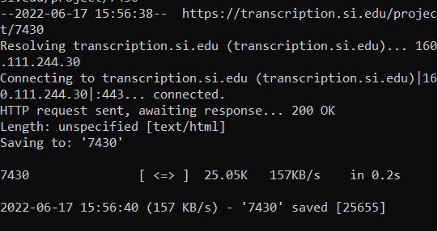

> I tried using wget to obtain to pull from the homepage of the collection. I got a file with an unkwnown extension and a wget-hsts file which i can't open to view contents.
I later tried to get the contents of an individual page of the diary and it worked.
